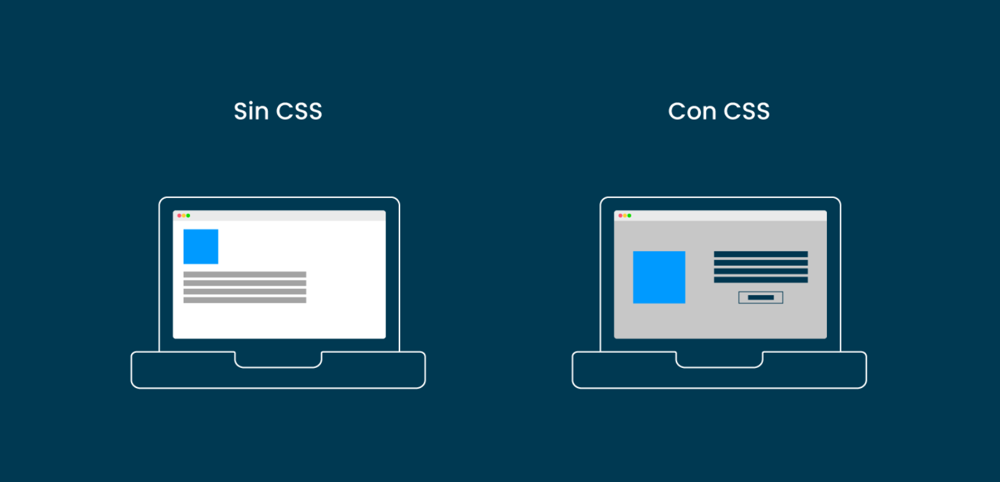
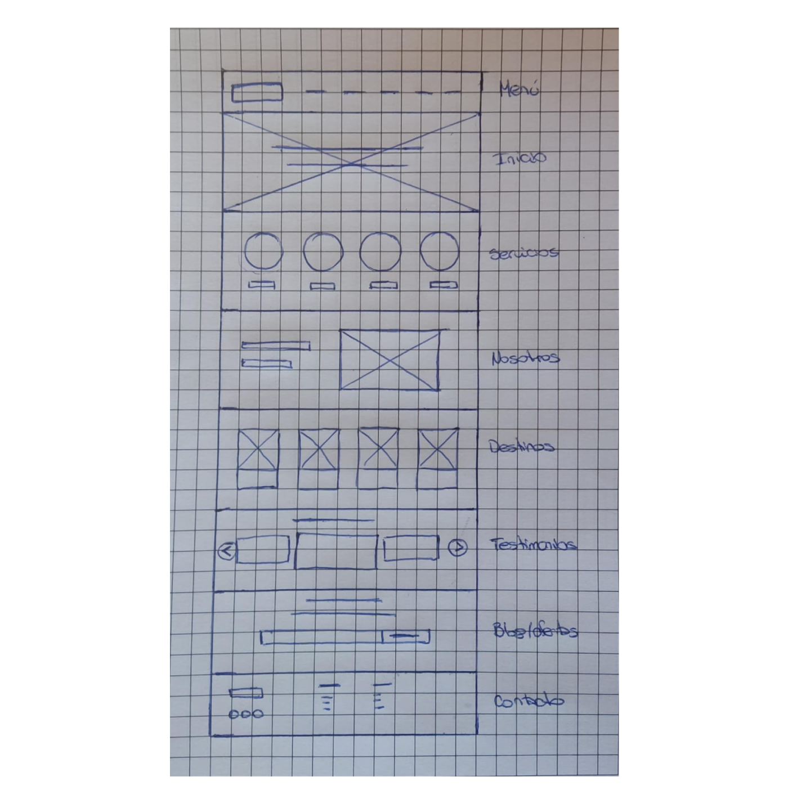
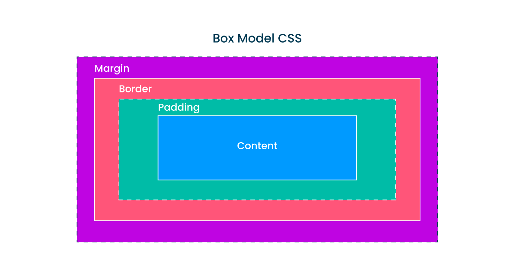
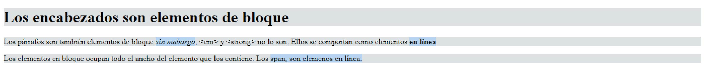
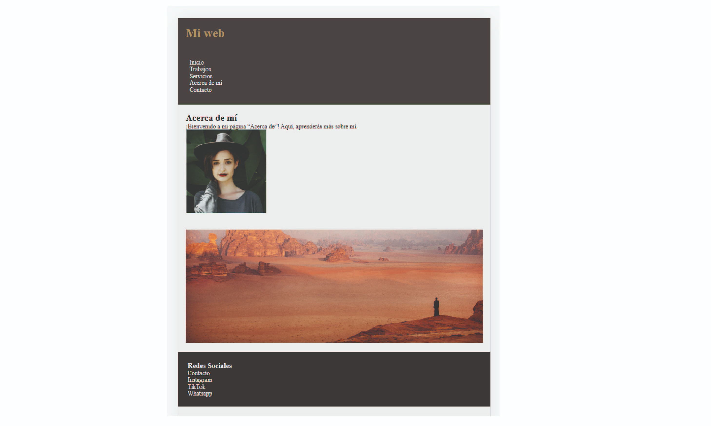

# clase_03
Introduccion al CSS a tu Ritmo
# 🏠 Paso 7 - ¡Introducción a las hojas de estilo!
👋 ¡Bienvenido a tu siguiente paso! 
¡Hola! Seguimos avanzando 👟

Como mencionamos al concluir el paso previo, ¡es momento de darle vida a tu diseño!

Hasta ahora tenemos el esqueleto de nuestra web, pero cuando navegamos por internet y visitamos otras páginas web, vemos que tienen diferentes estilos, colores, diseños y los elementos están organizados de cierta manera particular. 

Todo esto se logra aplicando CSS, ¿pero qué es CSS?

CSS es el acrónimo de Cascading Style Sheets, o lo que sería en español Hojas de Estilo en Cascada. Es un lenguaje que sirve para especificar el estilo o aspecto de las páginas web. 

¿Listo? ¡Vamos! 🚀

## 📖 Material descargable
Aquí es donde encontrarás el material descargable que complementará los ejercicios prácticos que vamos a ver en los siguientes pasos. 

Para tu primer encuentro en vivo tienes que leer solo el material que te compartimos a continuación 👉 Introducción a CSS

📢 ¡Importante!

* No debes memorizar, concéntrate en entender el concepto. La práctica hará que luego puedas aplicarlo con más agilidad.

* Si hay algo que no comprendes, ¡no te preocupes! Anótalo y pregunta a tus compañeros en el encuentro en vivo. 

✍️ Para tu próximo encuentro en vivo
En esta ocasión te vamos a pedir que crees tu hoja de estilo CSS y la linkees con tu web. No te preocupes si aún no sabes cómo hacerlo porque te lo mostramos en el siguiente video: 
https://youtu.be/jtxEQFzgNmk

✅ Checklist
Asegúrate de:

* Entender la diferencia entre HTML y CSS

* Haber leído el material de tu próxima clase.

* Haber linkeado el archivo CSS a tu web, siguiendo las instrucciones del video. 

💡 Revisar estos puntos es muy importante dado que ayudarán a que todos puedan tener la mejor experiencia posible y logren resolver los desafíos correspondientes.

# 👣 Paso 8 - ¡A trabajar en equipo!

👋 ¡Bienvenido a tu siguiente paso! 
Llegó el momento de darle vida a tu web aplicando estilos con CSS. 

🛑✋ Momento, antes de continuar, validen: ¿todos tienen creado y vinculado su archivo CSS? Si no es así, tómense el tiempo de realizar este paso y sacarse las dudas porque ¡lo vamos a necesitar!. Si algún paso de la vinculación se les dificulta, recuerden que pueden llamar al mentor para sacarse las dudas. 

¡Continuemos! 🚀

Las propiedades de CSS se utilizan para definir estilos para los elementos HTML. 

Estas son como las instrucciones de diseño que le damos a una página web para que se vea visualmente bonita y atractiva. Podemos cambiar el color del texto, el tamaño de la fuente, la imagen de fondo y muchos otros aspectos visuales. 

Vamos a ver las propiedades básicas, en el formato propiedad:valor;

* color: black; → Cambiar el color de la fuente del elemento seleccionado

* background-color: black; → Cambiar el color de fondo del elemento seleccionado

* font-family: Arial; → Cambiar el tipo de letra del elemento seleccionado

* font-size: 12px; → Cambiar el tamaño de letra del elemento seleccionado

* margin: 12px; → Cambiar el margen del elemento seleccionado. Espacio entre el borde y el siguiente elemento

* padding: 12px; → Cambiar el espaciado interno del elemento seleccionado. Espacio entre el contenido del elemento y su borde

En esta primera parte de CSS vamos a ver cómo aplicar estilos utilizando selectores de etiqueta (#spoiler, existen otros selectores que veremos más adelante). Los selectores de etiqueta apuntan a seleccionar elementos de HTML puntuales como header, nav, div, footer.

💡 Para este paso, les vamos a pedir que:

🔸Resuelvan individualmente el ejercicio en su propia computadora.

🔸Preguntar a tus compañeros en caso de no entender alguna parte. 

🔸Si no logran resolver algo entre todos, no olviden llamar al mentor para que los ayude. 

📌 ¡Recuerden mantener las cámaras encendidas en todo el proceso! ¡Sé protagonista de tus objetivos!

## ✏️ Actividad - Aplicando estilos CSS
Mira el siguiente video y luego ponte a prueba y demuestra tu destreza, realizando la actividad que te proponemos: 

https://youtu.be/Dv04eynOFHM

 Ahora sigue estos pasos, en tu compu: 

* Cambiar el color de fondo de toda tu web (puedes elegir el color que prefieras)

* Cambiar el color de fondo de cada sección de tu HTML, eligiendo como selectores, el header, footer, main, section, que habíamos creado con anterioridad. 

* Establecer el tipo de fuente del header por “Arial”. 

* Cambiar el tamaño de fuente del párrafo a 12px. 

💡 Cuando todos hayan logrado seguir las instrucciones, de a uno vayan compartiendo pantalla mostrando su código y el resultado de su CSS.

✨ Ejercicio complementario: 

Como ejercicio complementario, intenten modificar el margin y el padding de algún elemento que deseen (como header o footer) para ver qué ocurre en la práctica. 

➕ Referencia de cómo debería verse la estructura del sitio

Sí, aún no se ve muy lindo 🤡, pero es importante entender cómo el CSS modifica los selectores, para luego hacer cambios de acuerdo a nuestro propio estilo.

✅ Checklist
Asegúrate de:

Haber agregado colores a tu web

Haber modificado el tipo de fuente

Haber modificado el tamaño de la fuente

💡 Revisar estos puntos es muy importante dado que ayudarán a que todos puedan tener la mejor experiencia posible y logren resolver los desafíos correspondientes.

Si queres colaborar o sugerir algun cambio en este paso, hacelo 👉 aquí.

# 👣 Paso 9 - ¡Seguimos con CSS!

👋 ¡Bienvenido a tu siguiente paso! 
Otro punto importante a tener en cuenta en CSS, es el “modelo de caja” o “Box Model”

Para CSS cada elemento es considerado como una "caja" que consta de cuatro partes: 

* Content

* Padding

* Border

* Margin

Mira el siguiente video y luego ponte a prueba y demuestra tu destreza, realizando la actividad que te proponemos: 
https://youtu.be/gm04v_aRFKs
💡 Para este paso, les vamos a pedir que:

🔸Resuelvan individualmente el ejercicio en su propia computadora.

🔸Preguntar a tus compañeros en caso de no entender alguna parte. 

🔸Si no logran resolver algo entre todos, no olviden llamar al mentor para que los ayude.

 

📌 ¡Recuerden mantener las cámaras encendidas en todo el proceso! ¡Sé protagonista de tus objetivos!

## ✏️ Actividad - Practicando con el Modelo de Cajas

Para este ejercicio vamos a corrernos un ratito de la web que venimos armando, para poder practicar exclusivamente el modelo de cajas, ya que es un concepto fundamental en CSS. 

Para ello, sigue estos pasos, en tu compu: 

1. Dentro de la estructura de carpetas donde vienes trabajando, crea una nueva carpeta dentro de PWDC que se llame 📁 css-modelo-de-cajas. Esta no se encuentra dentro 📁mi_primera_web, sino que se encuentra a la misma altura.

2. Dentro de ella, crea un archivo HTML llamado cajas.html y coloca el siguiente código

<!DOCTYPE html>
<html lang="es">
  <head>
    <meta charset="UTF-8" />
    <title>Modelo de cajas</title>
    <link rel="stylesheet" href="box-styles.css" />
  </head>
  <body>
    <h1>Los encabezados son elementos de bloque</h1>

    

      Los párrafos son también elementos de bloque <em>sin mebargo</em>,
      &lt;em&gt; y &lt;strong&gt; no lo son. Ellos se comportan como elementos
      <strong>en línea</strong>
    

    

      Los elementos en bloque ocupan todo el ancho del elemento que los
      contiene. Los span, son elemenos en línea. 
    

  </body>
</html>

3. Crea el archivo box-styles.css en la misma carpeta que cajas.html (en el HTML que te brindamos ya se encuentra vinculado si mantienes los nombres de los archivos tal como están escritos).

4. Coloca el siguiente código css en el archivo box-styles.css

h1,p,div { background-color: #dde0e3;}
em,strong,span { background-color: #b2d6ff;}
Aquí lo que estamos haciendo es aplicar un color de fondo para los elementos HTML que se comportan como bloque y otro para los elementos que se comportan como en línea. 

💡Tip: Si más de un elemento contiene los mismos estilos de CSS, podemos separar a los selectores con una coma, y luego escribir una sola vez las propiedades y valores. Ejemplo: elemento1, elemento2, elemento3 {propiedad:valor;}

Al final deberían obtener una página similar a la siguiente:

5. Al elemento h1, aplicarle un padding de 50px, margin de 50px y border 5px solid black.

💡Tip: Para la propiedad border, lo que hicimos es darle un ancho en pixels al borde (5px), indicarle que deberá ser sólido (solid), y de color negro (black).

6. Al elemento div, aplicarle el siguiente padding: 10px 5px 15px 3px; (De esta manera, al asignar "10px 5px 15px 3px" se está indicando un margen superior de 10px, uno derecho de 5px, un margen inferior de 15px e izquierdo de 3px)

7. Agreguen border, margin y padding al resto de los elementos y visualicen cómo se comportan.

💡 Cuando todos hayan logrado seguir las instrucciones, de a uno vayan compartiendo pantalla mostrando su código y el resultado de su CSS.

## ✨ Ejercicio complementario:
Como ejercicio complementario te incentivamos a que puedas aplicar lo aprendido a tu página web:

Coloca colores de fondo para el header y el footer

Da color a los textos de manera que contrasten con el color de fondo

Aplica margin, paddings y border en los lugares necesarios para que el contenido tenga aire visualmente

➕ Referencia de cómo debería verse la estructura del sitio

✅ Checklist
Asegúrate de:

Haber aplicado propiedades de CSS a tu sitio

Haber practicado el modelo de cajas 

💡 Revisar estos puntos es muy importante dado que ayudarán a que todos puedan tener la mejor experiencia posible y logren resolver los desafíos correspondientes.

🔎 Resumen y buenas prácticas aprendidas
Las propiedades de css se escriben con el formato propiedad:valor;

Repasar las propiedades básicas de css color, background-color, font-size, font-family, margin, padding

El modelo de cajas es la forma en que se estructuran los elementos HTML, y sus componentes son content, padding, border, margin

📓 Test
Por último, te proponemos realizar un muy breve test para poner a prueba los aprendizajes alcanzados. Vamos 🚀

📝 Realizar test
https://eggeducacion.typeform.com/to/RQL0zZhx#form_type=autoevaluacion&profile_id=65125470f615c80f596b9c9c&step_id=3S8bXqNYgpIkxzBGBa3goY&module_id=1aVJePrGRBrkp5WrfPIzbW&section_id=4Mibq2ipmSr4HDLwFIriLt

⏭️ En el próximo encuentro veremos otras formas de seleccionar elementos de HTML con CSS y las diferencias con los selectores de etiquetas.

Si queres colaborar o sugerir algun cambio en este paso, hacelo 👉 aquí.
