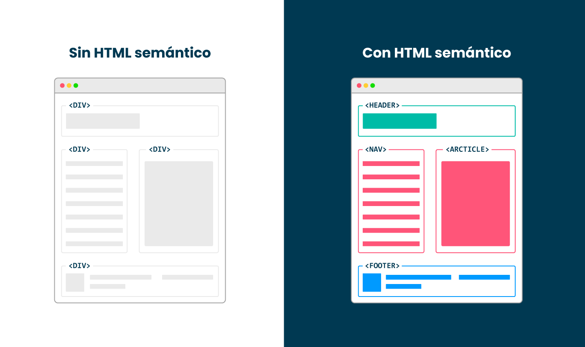
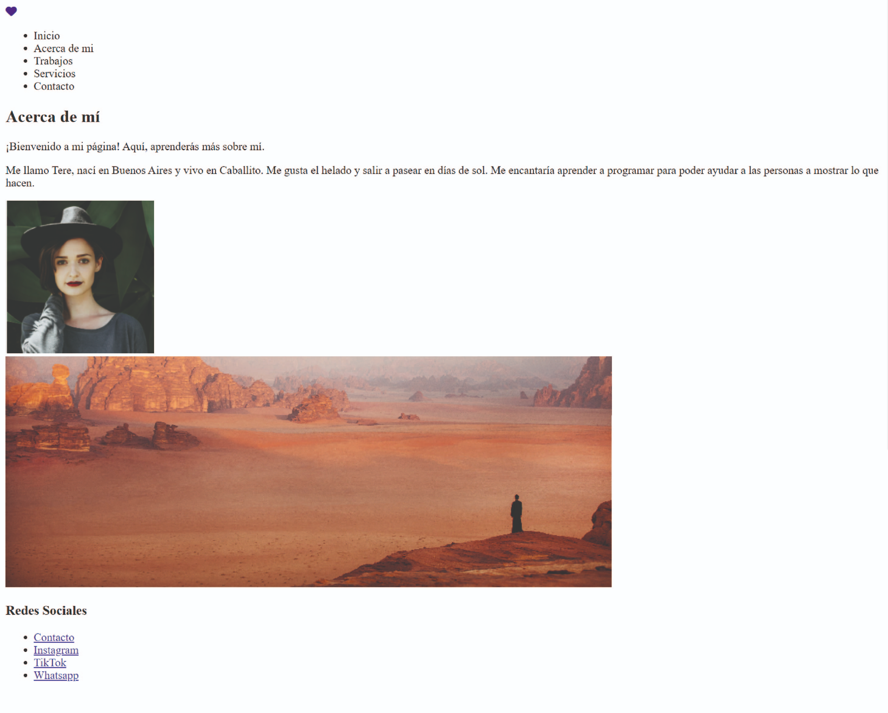

Programacion Web Desde Cero
Referidos
# 🏠 Paso 7 - ¡Introducción a HTML Semántico y selectores en CSS!
👋 ¡Bienvenido a tu siguiente paso! 
¡Hola! Seguimos avanzando 👟

Como mencionamos previamente, la estructura de las páginas web es un punto muy relevante, y a esta estructura se la denomina esquema. El esquema (outline) de una página web actúa como un índice, mostrando la relación jerárquica entre los distintos apartados y subapartados de la página.

Esta forma de trabajar de manera más esquemática se conoce como HTML semántico, que sirve para darle una estructura organizada a tu página web. En lugar de simplemente poner bloques de contenido en tu sitio, utilizas etiquetas HTML que tienen un significado específico para indicar qué tipo de contenido está en ese bloque. Esto ayuda a los navegadores web, motores de búsqueda y personas a entender mejor la información en tu página.

🧘 Respira y activa #ModoHakunaMatata, con este ejemplo vas a entender mejor la definición de arriba:

Sin HTML semántico, la estructura de la web es simplemente una estructura de “cajas†utilizando los elementos 
. En cambio, con HTML semántico, las etiquetas describen el contenido y su función dentro de la página, lo que facilita la lectura y comprensión del código.

Como puedes ver, el HTML semántico utiliza etiquetas como <header>, <footer>,  <nav>, <main>, y <article> que describen claramente la función de cada sección. Esto mejora la accesibilidad y puede facilitar el mantenimiento y la comprensión del código.

¿Funcionan los dos? Sí. ¿La página web se ve igual? Sí. 

Entonces, ¿cuál debo usar? En verdad es una combinación de ambos, pero el HTML semántico, es mejor para la comprensión del código, y para que los buscadores posicionan mejor el sitio web en los resultados de sus búsquedas.

Por otro lado, hasta aquí vimos cómo aplicar reglas de CSS directamente haciendo referencia a las etiquetas HTML, como por ejemplo:

h1 {background-color: red;}
Pero hay otras maneras de seleccionar elementos en CSS, los selectores de clase y los selectores de id. Estos selectores están relacionados con los atributos que pueden contener los elementos HTML, que no son más que características que se le pueden agregar al elemento. 

Atributo class

 Contenido 

En este ejemplo el atributo que le estamos agregando es el de clase (class) y lo que hace este atributo es agregarle un nombre a esta etiqueta div. 

En CSS vamos a usar entonces el selector de clase, haciendo referencia a este atributo con su nombre, para ello tendremos que inicializar con un punto.

.container {color:red;}
Atributo id

 Contenido 

En este ejemplo el atributo que le estamos agregando es el de identificador(id) y lo que hace este atributo es agregarle un nombre a esta etiqueta div. ¿Cuál es la diferencia con el de clase? Que el de id no se puede repetir y además es más específico al momento de agregar estilos (veremos más sobre especificidad en breve) En CSS vamos a usar entonces el selector de id, haciendo referencia a este atributo con su nombre, para ello tendremos que inicializar con un numeral.

#container {color:red;}
Otros atributos que existen son: style, href, rel, title, alt, src, entre otros, que pueden ver en el siguiente link 👉 Referencia de atributos HTML

En el siguiente video mostramos ejemplos de cómo aplicar id y class a los elementos y como modificarlo con CSS:
https://youtu.be/A1PYOBVLU_M

Otro punto muy importante a tener en cuenta al momento de escribir CSS es la especificidad, para entender este punto les dejamos el siguiente video:
https://youtu.be/zTV2Wg9Vpp8
Pueden leer más sobre especificidad en el siguiente link 👉 Especificidad en CSS

¡Vamos con algunas actividades!

Aquí es donde encontrarás el material descargable que complementará los ejercicios prácticos que vamos a ver en los siguientes pasos. 

Para tu encuentro en vivo tienes que leer solo el material que te compartimos a continuación 

👉 HTML semántico

👉 Selectores CSS

📢 ¡Importante!
✍️ Para tu próximo encuentro en vivo
En esta oportunidad vamos a proponerte reflexionar acerca de la organización que deseas otorgarle a tu página web, considerando los conocimientos adquiridos como el uso de HTML semántico y elementos div.

Contempla qué elementos deberían estar presentes en la sección de encabezado (header) y en la sección de pie de página (footer).

💡Tip: usar lápiz y papel 📝 para hacer un diagrama visual de tu sitio. 

Les dejamos un ejemplo de cómo podría verse el diagrama (no es necesario que luzca igual ni que tenga mucho detalle, pero sí analizar cómo podría estar compuesta la web que estamos observando)

Te proponemos explorar los siguientes sitios web, analizando detenidamente su estructura. Los enlaces de los sitios a investigar son los siguientes:

https://www.minicarbono.com/

https://www.nathanieldrew.com/

Piensa: ¿Cómo quieres estructurar tu sitio teniendo en cuenta lo analizado?

¿Qué pondrías en el header? ¿Tendría un menú de navegación?

¿Cuál sería su contenido?

¿Qué pondrías en el footer?

En el próximo paso construirás tu web con estos lineamientos, ¡te esperamos! 🚀

Asegúrate de:

* Haber leído el material de tu próxima clase.

* Pensar la estructura de tu web para comenzar a armarla. 

💡 Revisar estos puntos es muy importante dado que ayudarán a que todos puedan tener la mejor experiencia posible y logren resolver los desafíos correspondientes. 

# 👣 Paso 8 - Construyendo el sitio web - Parte 1

## 👋 ¡Bienvenido a tu siguiente paso! 
Como vimos en los pasos anteriores, HTML está compuesto por elementos. El más conocido es el elemento 
, que como vimos anteriormente no es un elemento semántico, pero sí es muy útil para organizar nuestro sitio. 

Ahora veremos elementos que se comportan como el 
 pero tienen un sentido semántico, como ser

<header>: Se utiliza para incluir contenido introductorio o de navegación en la parte superior de una página como el logo del sitio, el título de la página, el menú de navegación y otros elementos relacionados con su identidad. 

<nav>: Se utiliza para definir una sección de navegación dentro de un sitio web. Suele contener enlaces a otras páginas o secciones del mismo sitio.

<main>: Se utiliza para envolver el contenido principal de la página excluyendo encabezados, pies de página, barras laterales u otras secciones. Ayuda a los usuarios a enfocarse en la información más relevante. Es importante tener en cuenta que solo debe haber un elemento <main> por documento HTML.

<section>: Se utiliza para agrupar contenido relacionado dentro de un documento. Puede ser utilizado para dividir el contenido en diferentes secciones temáticas o para organizar el contenido en una página.

<footer>: Se utiliza para incluir información de contacto, enlaces relacionados, derechos de autor y otros elementos que suelen ubicarse en la parte inferior de una página. Proporciona una ubicación específica para la información de cierre. 

En el siguiente video les contamos un poco más respecto a estos elementos:
https://youtu.be/O5bzMtBSrl8 

Construyendo la barra de navegación del sitio - HTML
El objetivo de esta actividad es construir la barra de navegación del sitio web en HTML que luzca parecida a la siguiente barra.

Test
Veremos, entonces, otras etiquetas HTML como imágenes y links. 

Imágenes

Las imágenes se incluyen en las páginas web con la etiqueta  de la siguiente manera:

💡 Para que la imagen se visualice correctamente se debe asociar a la ruta adecuada. Si la imagen está guardada en la carpeta imágenes, entonces la ruta quedará de la siguiente manera . 

Links

Para crear un enlace en HTML, se utiliza la etiqueta <a> (ancla), que tiene el siguiente

formato:

<a href="https://www.google.com/">Texto o contenido del enlace</a>
💡 Debemos reemplazar "https://www.google.com/" por la url que deseemos. 

Ahora sí, vamos al ejercicio y sigamos estos pasos: 

Dentro del documento index.html que se encuentra en tu carpeta mi_primera_web, crea un 

 que oficiará de contenedor de todo el sitio. 

Dentro del div anterior, crea un encabezado con la etiqueta semántica <header> </header> 

Dentro de <header> </header>  vamos a crear un elemento que contenga un logo y un elemento que contenga el menú de la página. Para el logo usaremos el elemento  y elemento <i/> (este elemento lo obtendremos desde la página de fontawesome*)

Para el menú, primero crearemos una etiqueta <nav></nav> y dentro una etiqueta <ul></ul>, con los elementos <li></li> correspondientes. 

🧰 Herramientas: Para usar a modo de logo en esta instancia podés descargar un ícono de la página de 👉 Fontawesome

 ¿Cómo logro esto? Si tienes dudas, podrás ver el paso a paso en el siguiente video:
 https://youtu.be/e4TDZisjnMY

 👣 Paso 9 - Construyendo el sitio web - Parte 2

👋 ¡Bienvenido a tu siguiente paso! 
Continuamos construyendo tu sitio web. Es hora de poner en código lo que hemos visto hasta aquí. 

¡No te preocupes que siempre hay tiempo para modificarlo! 

Construyendo la sección principal del sitio - HTML
El objetivo de esta actividad es construir el resto del sitio con sus elementos semánticos. 

Tomamos como referencia la siguiente imagen:

Para lograrlo vamos a seguir estos pasos:

## Estructura Principal:

La página debe contener un elemento <main> con el ID seccion-principal.

Dentro del elemento <main>, debes crear dos secciones <section>: una con la clase seccion-1 y la otra con la clase seccion-2.

## Sección 1: Acerca de mí

Dentro de la seccion-1, crea un 
 con la clase acerca-de.

Dentro del div anterior, añade un encabezado de nivel 2 (<h2>) con el texto "Acerca de mí".

Añade dos párrafos (
) debajo del encabezado. El primer párrafo debe tener la clase parrafo1 y el segundo la clase parrafo2.

El primer párrafo debe contener el texto: "¡Bienvenido a mi página! Aquí, aprenderás más sobre mí."

El segundo párrafo debe contener información personal, por ejemplo: "Me llamo Tere, nací en Buenos Aires y vivo en Caballito. Me gusta el helado y salir a pasear en días de sol. Me encantaría aprender a programar para poder ayudar a las personas a mostrar lo que hacen."

## Imagen Personal:

Aún dentro de la seccion-1, pero fuera del div con clase acerca-de, crea otro div con la clase acerca-imagen.

Dentro de este div, añade una imagen () con el src apuntando a "img/hero-img.png" y un alt con la descripción "imagen personal".

## Sección 2: Imagen de Carrusel

En la seccion-2, añade una imagen () con el src apuntando a "img/carrusel-img.png" y un alt con la descripción "imagen de carrusel".

## Footer

Para el footer utilizar la etiqueta semántica <footer></footer> , agregar un título <h3>, y armar un menú como en el header con los items que desees. 

 ¿Cómo logro esto? Si tienes dudas, podrás ver el paso a paso en el siguiente video:
 https://youtu.be/prcQ3j-1hQA
 